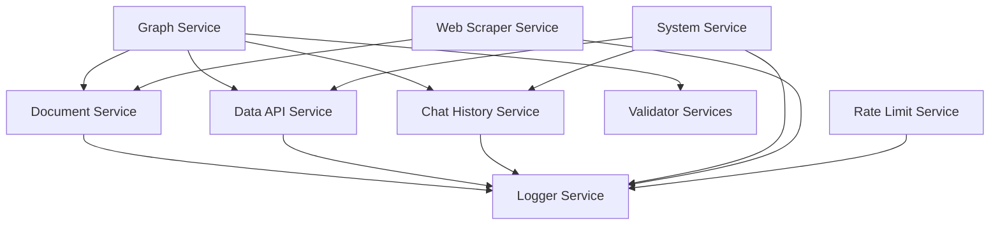

# Services Documentation

## Overview

This document provides an overview of all service components in the Recruiter AI application. Each service has its own dedicated documentation that details functionality, usage, and configuration options.

## Service Architecture

The application follows a Service-Oriented Architecture (SOA) where each service is responsible for a specific business logic area. Services operate asynchronously and communicate through well-defined interfaces.

## Service Catalog

### 🗨️ [Chat History Service](./chat_history_service.md)

**Responsibility**: Managing user conversation histories

**Main Features**:
- Chat history storage in Redis
- Session management
- Conversation metadata
- User-specific histories

**Technologies**: Redis, AsyncIO, JSON

---

### 🔧 [Data API Service](./data_api_service.md)

**Responsibility**: Communication with external Data API and settings management

**Main Features**:
- Application settings retrieval
- HTTP client management
- Configuration validation
- API error handling

**Technologies**: httpx, AsyncIO, Environment Variables

---

### 📊 [Dataset Service](./dataset_service.md)

**Responsibility**: ML dataset management with LangSmith integration

**Main Features**:
- Dataset creation and management
- Async/sync execution
- Model evaluation
- Background task coordination

**Technologies**: LangSmith, LangChain, AsyncIO

---

### 📄 [Document Service](./document_service.md)

**Responsibility**: Document processing and vector database storage

**Main Features**:
- Multi-format file support (PDF, DOCX, TXT, Excel)
- Intelligent text chunking
- Redis Vector Store integration
- Embedding generation

**Technologies**: LangChain, Redis Vector Store, PyPDF, Docx2txt

---

### 🤖 [Graph Service](./graph_service.md)

**Responsibility**: Multi-agent graph execution with supervisor pattern

**Main Features**:
- Multi-agent orchestration
- LangGraph workflow management
- State management and checkpointing
- Streaming responses
- Tool integration

**Technologies**: LangGraph, LangChain, Redis, importlib

---

### 📝 [Logger Service](./logger_service.md)

**Responsibility**: Structured application logging

**Main Features**:
- JSON formatted logging
- File rotation
- Multi-level output (console + file)
- Configurable log levels

**Technologies**: Python logging, RotatingFileHandler, JSON

---

### 🚦 [Rate Limit Service](./rate_limit_service.md)

**Responsibility**: API rate limiting with Token Bucket algorithm

**Main Features**:
- IP-based rate limiting
- Token bucket algorithm
- FastAPI middleware integration
- Asynchronous waiting

**Technologies**: FastAPI, AsyncIO, Token Bucket, Middleware

---

### 🖥️ [System Service](./system_service.md)

**Responsibility**: System monitoring and health checks

**Main Features**:
- Comprehensive health checks
- System metrics (CPU, memory, disk)
- External service monitoring
- Log file management

**Technologies**: psutil, pathlib, httpx, asyncio

---

### 🌐 [Web Scraper Service](./web_scraper_service.md)

**Responsibility**: Automated web data extraction

**Main Features**:
- Scrapy-based web scraping
- Multi-format output (JSON, PDF, DOCX, Vector DB)
- Domain restrictions and robots.txt respect
- Content filtering and cleaning

**Technologies**: Scrapy, Twisted, ReportLab, Python-docx, LangChain

---

### ✅ [Validator Services](./validator_services.md)

**Responsibility**: Various validation operations

**Main Components**:
- **Token Validation**: Token counting and text truncation
- **Personal Data Filter**: Personal data detection and filtering
- **Topic Validator**: Topic relevance validation

**Technologies**: tiktoken, spaCy, Transformers, AsyncIO

## Inter-Service Dependencies



## Configuration Overview

### Environment Variables

Common environment variables for all services:

```bash
# Redis configuration
REDIS_HOST=localhost
REDIS_PORT=6379
REDIS_USER=username
REDIS_PASSWORD=password

# Data API
DATA_API_BASE_URL=https://api.example.com
DATA_API_APP_SETTINGS_ROUTE_PATH=/api/app/{applicationId}/settings

# Logging
LOG_FILE_PATH=/path/to/logs/app.log
LOG_MAX_FILE_SIZE_MB=10
LOG_BACKUP_COUNT=5
```

### Service-Specific Configurations

Each service has its own configuration options, detailed in their respective documentation.

## Deployment Considerations

### Docker Integration

All services support Docker-based deployment:

```dockerfile
# Example Dockerfile snippet
FROM python:3.11-slim

COPY requirements.txt .
RUN pip install -r requirements.txt

COPY src/ ./src/
```

### Kubernetes Ready

Services are designed to run in Kubernetes environments:

- Health check endpoints
- Graceful shutdown handling
- Resource limit support
- ConfigMap and Secret integration

### Monitoring Integration

- **Prometheus**: Metrics export
- **Grafana**: Visualization
- **ELK Stack**: Log aggregation
- **Jaeger**: Distributed tracing

## Development Guidelines

### Coding Standards

- **Type hints**: All functions and methods
- **Docstrings**: Google style documentation
- **Error handling**: Comprehensive exception handling
- **Async/await**: Asynchronous programming patterns

### Testing

- **Unit tests**: Every service function
- **Integration tests**: Inter-service communication
- **Performance tests**: Load and speed testing
- **Security tests**: Vulnerability scanning

### Code Review

- **Pull requests**: All changes through review
- **Static analysis**: SonarQube or similar tools
- **Automated testing**: CI/CD pipeline integration

## Troubleshooting

### Common Issues

1. **Redis Connection Errors**
   - Check connection string
   - Verify Redis server status

2. **API Timeout Errors**
   - Increase timeout values
   - Check network connectivity

3. **Memory Leaks**
   - Use memory profiling tools
   - Check object references

### Debug Modes

All services support debug mode:

```python
import logging
logging.getLogger().setLevel(logging.DEBUG)
```

## Related Documentation

- [API Documentation](../api_documentation.md)
- [Installation Guide](../installation_guide.md)
- [Configuration Reference](../configuration_reference.md)
- [Troubleshooting](../troubleshooting.md)

## Contributing

To add a new service or modify existing ones:

1. Follow the existing service structure
2. Write appropriate documentation
3. Add unit and integration tests
4. Update this index document

## License

This documentation is under the application's license. See LICENSE file for details.
